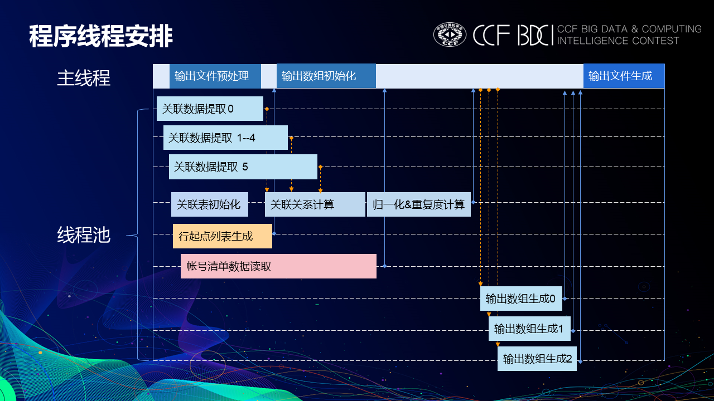

# RuiAn
参加 BDCI2020 身份归一赛题第1名方案

## 整体思路
根据赛题要求，针对给定数据集包括账号样本集和关联样本集，分析样本数据关联关系，根据账号关联关键，对相关ID进行最小值替换，
最后对账号进行遍历并关联序号最小值替换完成彼此关联的多个虚拟身份账号归一化处理。

## 线程安排
为了达到最高的计算效率，运用多线程异步并行和多种优化，线程安排如图所示。

## 主要优化策略
1. 多线程阶梯式关系数据读取
2. 有限深度并查算法
3. 免遍历数据规模估计
4. 输出数组超前预处理
5. 内存复用
6. Byte[]转int函数重写
